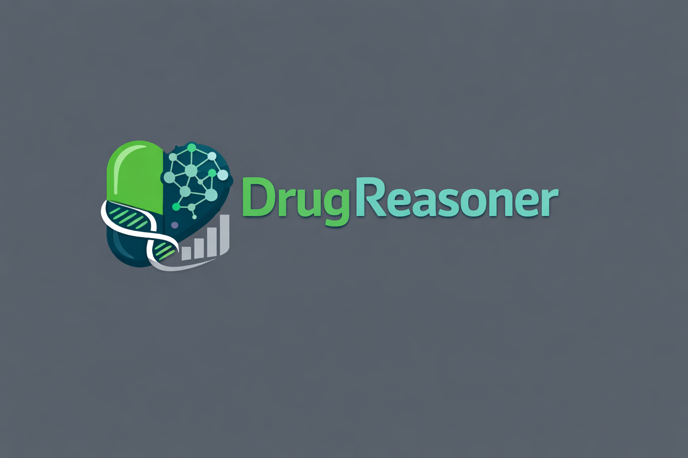

# DrugReasoner: Interpretable Drug Approval Prediction with a Reasoning-augmented Language Model

<p align="center">
  <a href="https://opensource.org/licenses/Apache-2.0">
    
  </a>
  <a href="https://www.python.org/downloads/">
    
  </a>
  <a href="https://arxiv.org/abs/2508.18579">
    
  </a>
  <a href="https://huggingface.co/Moreza009/Llama-DrugReasoner">
    
  </a>
  <a href="https://huggingface.co/datasets/Moreza009/drug_approval_all_classes">
    
  </a>
</p>

<p align="center">
  
</p>


**DrugReasoner** is an AI-powered system for predicting drug approval outcomes using reasoning-augmented Large Language Models (LLMs) and molecular feature analysis. By combining advanced machine learning with interpretable reasoning, DrugReasoner provides transparent predictions that can accelerate pharmaceutical research and development.


## ✨ Key Features

- **🤖 LLM-Powered Predictions**: Utilizes fine-tuned Llama model for drug approval prediction
- **🧬 Molecular Analysis**: Advanced SMILES-based molecular structure analysis
- **🔍 Interpretable Results**: Clear reasoning behind predictions for better decision-making
- **📊 Similarity Analysis**: Identifies similar approved/non-approved compounds for context
- **⚡ Flexible Inference**: Support for both single molecule and batch predictions

## 🛠️ Installation
-  To use **DrugReasoner**, you must first request access to the base model [Llama-3.1-8B-Instruct](https://huggingface.co/meta-llama/Llama-3.1-8B-Instruct) on Hugging Face by providing your contact information. Once access is granted, you can run DrugReasoner either through the command-line interface (CLI) or integrate it directly into your Python workflows.

### Prerequisites

- Python 3.8 or higher
- CUDA-compatible GPU (recommended for training and inference)
- Git

### Setup Instructions

1. **Clone the repository**
   ```bash
   git clone https://github.com/mohammad-gh009/DrugReasoner.git
   cd DrugReasoner
   ```

2. **Create and activate virtual environment**

   **Windows:**
   ```bash
   cd src
   python -m venv myenv
   myenv\Scripts\activate
   ```

   **Mac/Linux:**
   ```bash
   cd src
   python -m venv myenv
   source myenv/bin/activate
   ```

3. **Install dependencies**
   ```bash
   pip install -r requirements.txt
   ```
4. **Login to your Huggingface account**
You can use [this](https://huggingface.co/join) instruction on how to make an account and [this](https://huggingface.co/docs/hub/en/security-tokens) on how to get the token

   ```bash
   huggingface-cli login --token YOUR_TOKEN_HERE
   ```
## 🚀 How to use


**Note:** GPU is required for inference. If unavailable, use our [Kaggle Notebook](https://www.kaggle.com/code/mohammadgh009/drugreasoner).


#### CLI Inference
```bash
python inference.py \
    --smiles "CC(C)CC1=CC=C(C=C1)C(C)C(=O)O" "CC1=CC=C(C=C1)C(=O)O" \
    --output results.csv \
    --top-k 9 \
    --top-p 0.9 \
    --max-length 4096 \
    --temperature 1.0
```

#### Python API Usage
```python
from inference import DrugReasoner

predictor = DrugReasoner()

results = predictor.predict_molecules(
    smiles_list=["CC(C)CC1=CC=C(C=C1)C(C)C(=O)O"],
    save_path="results.csv",
    print_results=True,
    top_k=9,
    top_p=0.9,
    max_length=4096,
    temperature=1.0
)
```

## 📊 Dataset & Model

- **Dataset**: [](https://huggingface.co/datasets/Moreza009/drug_approval_prediction)
- **Model**: [](https://huggingface.co/Moreza009/Llama-DrugReasoner)

## 📈 Performance

DrugReasoner demonstrates superior performance compared to traditional baseline models across multiple evaluation metrics. Detailed performance comparisons are available in our [paper](https://arxiv.org/abs/2508.18579).


## 📝 Citation

If you use DrugReasoner in your research, please cite our work:

```
@misc{ghaffarzadehesfahani2025drugreasonerinterpretabledrugapproval,
      title={DrugReasoner: Interpretable Drug Approval Prediction with a Reasoning-augmented Language Model}, 
      author={Mohammadreza Ghaffarzadeh-Esfahani and Ali Motahharynia* and Nahid Yousefian and Navid Mazrouei and Jafar Ghaisari and Yousof Gheisari},
      year={2025},
      eprint={2508.18579},
      archivePrefix={arXiv},
      primaryClass={cs.LG},
      url={https://arxiv.org/abs/2508.18579}, 
}
```

## 📜 License

This project is licensed under the Apache License 2.0 - see the [LICENSE](LICENSE) file for details.


---

<div align="center">
  <strong>Accelerating drug discovery through AI-powered predictions</strong>
  <br><br>
</div>
